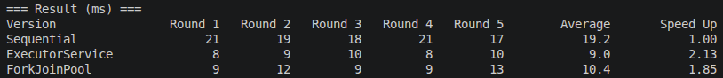
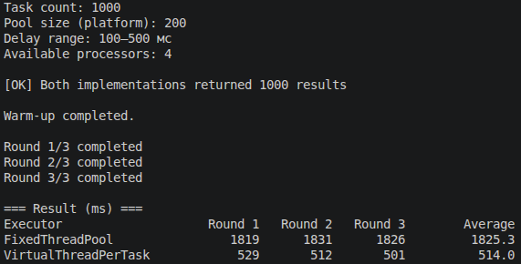
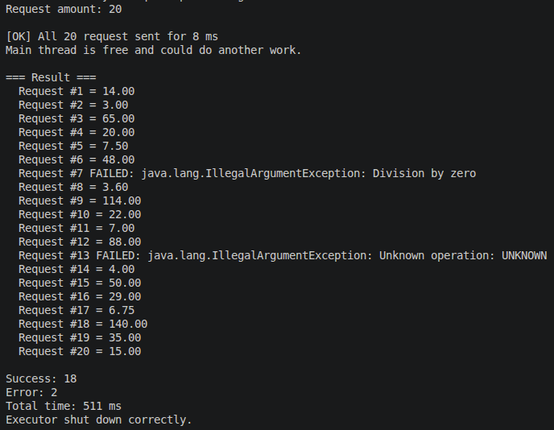
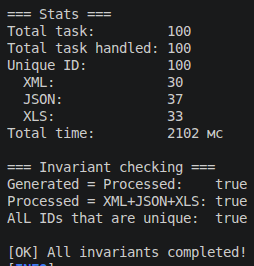

# Multithreading and Parallel computing in Java

**Дисциплина:** Проектирование и разработка клиент-серверных приложений  
**Учебный год:** 2026/2027  
**Технологии:** Java 25 LTS · Maven · JUnit 5 · Java Concurrency API

Практическая работа состоит из четырёх связанных заданий, посвящённых механизмам конкурентного выполнения в Java: platform threads, пулы потоков, Future, CompletableFuture, ForkJoinPool, virtual threads и обмен данными через BlockingQueue.

## Содержание

1. [Задание 1. Параллельная обработка массива](#задание-1-параллельная-обработка-массива)
2. [Задание 2. Platform Threads и Virtual Threads](#задание-2-platform-threads-и-virtual-threads)
3. [Задание 3. Асинхронная обработка запроса](#задание-3-асинхронная-обработка-запроса)
4. [Задание 4. Producer / Consumer](#задание-4-producer--consumer)

## Вариант

**Номер студента**: 5  
**Формула**: вариант = ((номер - 1) % 3) + 1 = 2  
**Операция**: поиск максимального элемента

## Требования

- JDK 25 (Oracle JDK или OpenJDK)
- Apache Maven 3.8+
- ОС Linux / macOS / Windows

Проверка версий:

```bash
java --version    # должно показывать Java 25
mvn --version     # Java version: 25
```

### Исходный код

- [task1/](src/main/java/task1/) - Параллельная обработка массива
- [task2/](src/main/java/task2/) - Platform Threads и Virtual Threads
- [task3/](src/main/java/task3/) - Асинхронная обработка запроса
- [task4/](src/main/java/task4/) - Producer / Consumer

## Команды запуска

Сборка проекта:

```bash
mvn clean compile
```

Запуск тестов:

```bash
mvn test
```

Запуск отдельного задания:

```bash
# Задание 1 - параллельная обработка массива
mvn exec:java -Dexec.mainClass="task1.Benchmark"

# Альтернативный способ (после mvn compile)
java -cp target/classes task1.Benchmark
```

## Задание 1. Параллельная обработка массива
[Содержание](#содержание)

### Цель

Сравнить производительность трёх реализаций для CPU-bound задачи - поиска максимального элемента в большом массиве целых чисел.

### Реализации

1. Последовательная (SequentialMax)

Один поток, линейный проход по массиву, поиск максимума за O(n). Служит базовой линией для сравнения.

2. Через ExecutorService (ExecutorMax)

Массив разбивается на N непересекающихся диапазонов, где N = Runtime.getRuntime().availableProcessors(). Каждый диапазон обрабатывается отдельным Callable<Integer>, возвращающим локальный максимум. Задачи отправляются в newFixedThreadPool(N), результаты объединяются через Math.max.

Обоснование числа worker threads: для CPU-bound нагрузки число потоков должно быть сопоставимо с числом доступных ядер. Избыточное число потоков увеличивает переключения контекста и не даёт ускорения.

3. Через ForkJoinPool (ForkJoinMax)

Рекурсивное деление массива пополам (RecursiveTask<Integer>) до достижения порога threshold. Левая половина отправляется через fork(), правая обрабатывается в текущем worker thread через compute(), результаты объединяются через join(). Используется механизм work stealing.

### Условия эксперимента

| Параметр | Значение |
|---|---|
| Модель CPU | Intel Core i5-7200U @ 2.50 GHz |
| **Физических ядер** | **2** |
| **Логических потоков (Hyper-Threading)** | **4** |
| `availableProcessors()` | 4 |
| Размер массива | 50 000 000 элементов (~200 МБ) |
| Seed генератора | 42 (фиксированный) |
| Число ядер CPU | 4 |
| Worker threads (Executor) | 4 |
| Порог ForkJoin | 100 000 |
| Warm-up | 3 запуска |
| Измеряемых запусков | 5 |
| Единица времени | миллисекунды (мс) |

### Проверка корректности

Перед измерением все три реализации запущены на одном и том же массиве и вернули одинаковый результат: **2147483565**. Это подтверждает, что разбиение на непересекающиеся диапазоны выполнено корректно: каждый элемент обработан ровно один раз.

### Результаты измерений



### Анализ результатов

**Ключевой факт:** процессор Intel Core i5-7200U имеет **2 физических ядра** и **4 логических потока** благодаря технологии Hyper-Threading.  
`Runtime.getRuntime().availableProcessors()` возвращает **4**, поэтому в эксперименте использовано 4 worker thread.

**Теоретический максимум ускорения:**

- 2 физических ядра → ускорение до ~2×
- Hyper-Threading добавляет ~15–30% → итоговый максимум ~2.3–2.6×
- На практике из-за накладных расходов реальный потолок ещё ниже

**Полученные результаты:**

| Реализация | Среднее (мс) | Ускорение |
|---|---|---|
| Последовательная | 19.2 | 1.00 |
| ExecutorService | 9.0 | **2.13** |
| ForkJoinPool | 10.4 | **1.85** |

**ExecutorService показал ускорение 2.13×** - это **практически совпадает с теоретическим максимумом для 2 физических ядер** (2×). Результат подтверждает, что распараллеливание выполнено корректно и эффективно.

**ForkJoinPool показал ускорение 1.85×** - немного ниже, чем ExecutorService.
Это объясняется тем, что при пороге 100 000 создаётся большое количество подзадач, каждая из которых требует создания объекта и синхронизации.
ExecutorService же создаёт ровно 4 задачи - по одной на логический поток - что минимизирует накладные расходы.

**Ускорение не превышает 2×, так как**

1. **Только 2 физических ядра.** Hyper-Threading не удваивает  
   вычислительные блоки - два логических потока на одном ядре  
   конкурируют за одни и те же АЛУ, кэш и декодеры инструкций.
2. **Накладные расходы.** Создание пула, отправка задач, объединение  
   результатов через `Future.get()`, синхронизация - всё это  
   не параллелится.
3. **Закон Амдала.** Доля последовательного кода (разбиение массива,  
   сравнение результатов) ограничивает максимальное ускорение.
4. **JIT-компиляция и GC.** Даже после warm-up JVM продолжает  
   оптимизировать код, а сборщик мусора периодически отвлекает CPU.
5. **Turbo Boost нестабилен.** На ноутбучном CPU частота может  
   снижаться из-за нагрева или энергосбережения (в выводе `lscpu`  
   видно `CPU scaling MHz: 26%` - процессор работает не на максимуме).

**Связь с `availableProcessors()`:**

Число worker threads (4) равно числу **логических** потоков, а не физических ядер (2). Это компромисс: Java не различает физические и логические ядра. В идеале для CPU-bound задач стоило бы использовать  
2 потока (по числу физических ядер), но так как Hyper-Threading даёт небольшой прирост, использование 4 потоков не критично - overhead минимален.

**Эксперимент с числом потоков:**

Если бы мы задали `numThreads = 2` (по числу физических ядер), результат, вероятно, был бы похожим - потому что Hyper-Threading даёт лишь небольшой прирост. Если бы задали `numThreads = 8`, ускорение **упало бы** из-за конкуренции за ресурсы и context switching.

### Вывод

На процессоре с 2 физическими ядрами и Hyper-Threading достигнуто ускорение **~2×**, что **соответствует теоретическому максимуму**.
Это подтверждает эффективность параллельной обработки для CPU-bound задач и демонстрирует важный принцип: **число потоков должно быть согласовано с числом доступных вычислительных ресурсов**.  
Дальнейшее увеличение числа потоков не даёт ускорения и может привести к замедлению.

## Задание 2. Platform Threads и Virtual Threads
[Содержание](#содержание)

### Цель

Сравнить производительность двух моделей выполнения для blocking-нагрузки: классических platform threads через фиксированный пул и виртуальных потоков через `newVirtualThreadPerTaskExecutor()`.
Продемонстрировать, что виртуальные потоки эффективно освобождают carrier thread во время ожидания, тогда как platform thread остаётся занятым на всё время блокировки.

### Модель нагрузки

Смоделировано **1000 независимых blocking-задач**. Каждая задача:

1. Выполняет небольшой объём вычислений (checksum по `workUnits` итераций).
2. Ожидает внешний ресурс - `Thread.sleep(delayMs)` со случайной задержкой
   в диапазоне **100–500 мс**. Это имитация blocking I/O.
3. Возвращает результат `BlockingTaskResult(id, elapsedMs, checksum)`.

**Важно:** искусственная задержка здесь допустима, потому что моделирует ожидание внешнего ресурса. В CPU-bound эксперименте (Задание 1) такой приём недопустим - там измеряется вычислительная нагрузка.

### Сравниваемые реализации

**1. `Executors.newFixedThreadPool(200)`**

Фиксированный пул из 200 platform threads.
Каждая задача отправляется через `submit()`, результаты собираются через `Future.get()`.
Пока задача выполняет `Thread.sleep()`, соответствующий platform thread остаётся **занятым** - операционная система не может использовать его для другой задачи. Из 1000 задач одновременно выполняются только 200; остальные ожидают в очереди.

**2. `Executors.newVirtualThreadPerTaskExecutor()`**

Для каждой задачи создаётся новый виртуальный поток.
Когда виртуальный поток выполняет `Thread.sleep()`, JVM **размонтирует** его с carrier thread и освобождает носитель для другой задачи.
Число carrier threads ограничено (≈ числу доступных процессоров), но благодаря размонтированию **все 1000 задач** могут находиться в состоянии ожидания одновременно.

### Условия эксперимента

| Параметр | Значение |
|---|---|
| Модель CPU | Intel Core i5-7200U @ 2.50 GHz |
| Физических ядер | 2 |
| Логических потоков (Hyper-Threading) | 4 |
| `availableProcessors()` | 4 |
| Количество задач | 1000 |
| Pool size (platform) | 200 |
| Диапазон задержек | 100-500 мс |
| Seed генератора | 42 (фиксированный) |
| Warm-up | 1 запуск |
| Измеряемых запусков | 3 |
| Единица времени | миллисекунды (мс) |

### Проверка корректности

Перед измерением обе реализации запущены на **одном и том же наборе из 1000 параметров задач** (`TaskFactory.createTasks(...)` с seed 42).
Обе вернули ровно **1000 результатов**, что подтверждает отсутствие потерянных или продублированных задач.

### Результаты измерений



**Ускорение:** 1825.3 / 514.0 ≈ **3.55×**

### Анализ результатов

Фиксированный пул из 200 потоков обрабатывает 1000 задач «волнами» по 200 - каждая волна ждёт свою задержку. Виртуальные потоки стартуют все сразу, и общее время определяется самой долгой задачей.

Ключевое различие: platform thread **остаётся занятым** во время `Thread.sleep()`, а virtual thread **размонтируется** с carrier thread и освобождает носитель. Именно поэтому виртуальные потоки дают многократный выигрыш на blocking-нагрузке.

При этом виртуальные потоки **не ускоряют CPU-bound вычисления**:
в любой момент времени реально работают лишь ~4 carrier threads (по числу процессоров). Большое число ожидающих virtual threads **не равно** большому числу одновременно выполняющихся вычислений.

### Вывод

Blocking-нагрузка - идеальный сценарий для виртуальных потоков. Ускорение 3.55× достигнуто за счёт размонтирования во время ожидания, а не за счёт «современности» технологии. Для CPU-bound задач (Задание 1) виртуальные потоки не дают выигрыша.

## Задание 3. Асинхронная обработка запроса
[Содержание](#содержание)

### Цель

Реализовать обработку запросов через `CompletableFuture` так, чтобы
основной поток не блокировался на каждом запросе, а ошибки и timeout
превращались в понятный результат.

### Модель

`Request(id, operandA, operandB, operation)` - операция `ADD`, `MUL`
или `DIV`. Pipeline:

```txt
Input → Validation → Calculation → Transformation → Result
```

```
| Стадия | Метод | Почему |
|---|---|---|
| Validation | `supplyAsync` | Начало async-цепочки, проверка данных |
| Calculation | **`thenCompose`** | Возвращает `CompletableFuture<Double>` - нужен flatten |
| Transformation | `thenApply` | Обычное преобразование `Double → Result` |
| Timeout | `orTimeout(2, SECONDS)` | Ограничение на всю цепочку |
| Ошибка | `exceptionally` | Формирует `Result.failure(...)` |
```

**`thenApply` vs `thenCompose`:** первый - синхронных преобразований,
второй - для асинхронных операций, возвращающих новый
`CompletableFuture`. Если применить `thenApply` к Calculation,
получится вложенный `CompletableFuture<CompletableFuture<Double>>`,
который пришлось бы разворачивать двумя `join()`.

### Основной поток не блокируется

`process()` возвращает управление немедленно, регистрируя цепочку.
Все 20 запросов отправлены за **8 мс**. Ожидание - один раз в конце
через `CompletableFuture.allOf(...).join()`. Это соответствует
требованию задания: не превращать решение в последовательный цикл
с `get()` после каждого `submit()`.

### Условия

| Параметр | Значение |
|---|---|
| Запросов | 20 |
| Pool size | 4 |
| Имитация I/O | `Thread.sleep(100)` |
| Timeout | 2 с |
| Успешных / с ошибкой | 18 / 2 |
| Общее время | 511 мс |

### Результаты измерений



Ошибки не уронили программу - они преобразованы в `Result.failure`.

### Анализ времени

20 запросов / 4 потока = **5 волн** × 100 мс = **~500 мс**.
Если бы запросы шли последовательно, время было бы 20 × 100 = 2000 мс.
Значит, асинхронная обработка действительно работает параллельно.

### Вывод

Реализована полноценная async-обработка через `CompletableFuture`:
non-blocking main thread, параллельная обработка, корректное
разделение `thenApply`/`thenCompose`, обработка ошибок через
`exceptionally`, timeout и graceful shutdown executor.

## Задание 4. Producer / Consumer
[Содержание](#содержание)

### Цель

Реализовать конечную модель обработки файловых задач через
`BlockingQueue` без busy waiting, с backpressure и корректным
завершением без `Ctrl+C`.

### Модель

`FileTask(id, type, size)` — тип `XML` / `JSON` / `XLS`,
размер 10–100. Длительность обработки пропорциональна размеру.
Архитектура: **общая очередь + пул потребителей** с маршрутизацией.

### Ключевые решения

| Проблема | Решение |
|---|---|
| Busy waiting | `queue.poll(100, MS)` вместо `while(isEmpty())` |
| Backpressure | `ArrayBlockingQueue(20)` + блокирующий `put()` |
| Завершение без Ctrl+C | `AtomicInteger remainingTasks` + 2 `CountDownLatch` |
| Потокобезопасные счётчики | `LongAdder`, `ConcurrentHashMap`, `AtomicInteger` |
| Дубликаты | `ConcurrentHashMap.putIfAbsent(id, TRUE)` → fail-fast |
| Interruption | `catch (InterruptedException)` с `Thread.currentThread().interrupt()` |

### Условия

| Параметр | Значение |
|---|---|
| Задач | 100 |
| Ёмкость очереди | 20 |
| Потребителей | 3 |
| Размер задачи | 10–100 мс |
| Seed | 42 |
| JDK | Java 25.0.4.1 (Oracle) |

### Результаты



### Анализ

- 100 задач × средний размер 55 мс = 5500 мс последовательной работы.
- 3 потребителя → ≈ 1833 мс. Фактически 2102 мс с учётом пауз producer.
- **Backpressure** включается автоматически, когда producer быстрее consumers.
- **Гарантия «ровно один раз»**: `BlockingQueue` + уникальные ID + `putIfAbsent`.

### Вывод

Классическая схема producer/consumer реализована корректно:
без busy waiting, с backpressure, потокобезопасной статистикой
и конечным протоколом завершения. Модель применима к реальным
клиент-серверным системам: очередь задач между фронтендом
и пулом воркеров.
